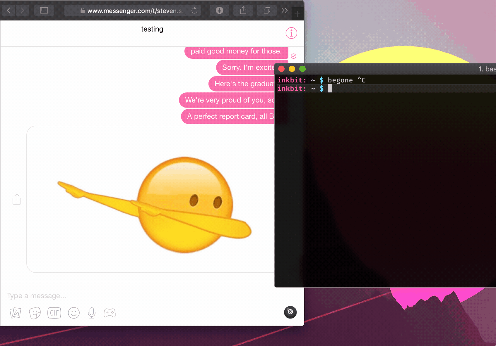

# begone

_A fully automatic spamming tool, created for the sole purpose of obliterating
conversation threads on [Facebook Messenger](https://messenger.com)._

[![Release][release-img]][release]
[![Go Report Card][grp-img]][grp]
[![Travis: Build][travis-img]][travis]

Works with individual conversations as well as group threads—a real versatile
beast. Uses a [modified version](https://github.com/stevenxie/fbmsgr) of
[`unixpickle/fbmsgr`](https://github.com/unixpickle/fbmsgr) as the underlying
Messenger client. And, like all my CLI programs, written in
[Go](https://golang.org).

<br />
<p align="center">
  
</p>

#### Project Status:

`finished` `feature-complete`

> Updates from now on will only be for maintenance. If Facebook's hidden
> Messenger API is updated drastically, this project will be deprecated. Let's
> hope that doesn't happen anytime soon!

## Features

- `begone emojify` – send streams of emojis, en masse
- `begone repeat` – keep repeating a message
- `begone file` – send a file one line at a time
- `begone image` – continually send an image

## Usage

### Installation

#### Using Homebrew:

If you're on macOS and have [Homebrew](https://brew.sh), you're in luck! Just
run:

```bash
brew install stevenxie/tap/begone
```

This will install `begone` from the Homebrew tap
[`stevenxie/tap`](https://github.com/stevenxie/homebrew-tap).

#### Manually:

Grab the [latest release](https://github.com/stevenxie/begone/releases) compiled
for your system.

Ensure that the binary is executable, and place it somewhere in your `$PATH`.
For macOS users, this might look something like this:

```bash
$ cd ~/Downloads
$ unzip begone-1.5.2-macOS-x86_64.zip
$ mv begone-1.5.2-macOS-x86_64/begone /usr/local/bin/begone
$ chmod u+x /usr/local/bin/begone
```

### Running

```bash
## (Optional) save login credentials to ~/.begone.json.
$ begone login

## Launch an emoji attack on a conversation thread.
$ begone emojify
Enter the target conversation URL (https://messenger.com/t/...):
https://messenger.com/t/exampleid

## See all options.
$ begone help
$ begone help <command>  # i.e. begone help emojify
```

<br />

## Advanced Usage

### Piping to `begone`

As of `v1.5.0`, it is possible to pipe from an external source to `begone`. This
notably allows for integration with [`dgen`](https://github.com/stevenxie/dgen),
resulting in one of the most destructive command pipelines I have ever seen (which can
output at a rate of ~30,000 emojis per second):

```bash
dgen "👅" fb | begone repeat --stdin <conversation ID>
```

_Reserve this pipeline for extremely rare occasions. I am not responsible for
the extreme amount of damage this might cause if used regularly._

### Making from source

> This requires the [Go](https://golang.org) language and associated toolchain
> to be installed. If you're on macOS, this may be as easy as
> `brew install go`!

```bash
go get -u github.com/stevenxie/begone
```

## FAQ

### Will this steal my password?

No. Your password is sent directly to Facebook's servers, as if you were logging
in from [messenger.com](https://www.messenger.com) or from Facebook itself.

_Don't want to take my word for it?_ See the code for yourself:
[`begone/pkg/mbot/login.go`](https://github.com/stevenxie/begone/blob/master/pkg/mbot/login.go#L14)
[`fbmsgr/auth.go`](https://github.com/stevenxie/fbmsgr/blob/27295a7d480147bdf80f88f01ac9d0fc4b4dffba/auth.go#L76)

### Will I get banned for using this?

Uhhhh I mean, don't use this too often (and don't leave it running for too long)
and you should be fine.

Just... play it safe-ish. Don't abuse this tool too much.
[_The Zucc_](https://www.urbandictionary.com/define.php?term=The%20Zucc) is
always watching 👀.

<br />

## TODOs

- [x] (maybe) Implement attacks using local files (images)?
- [x] Add more emojis to the `Emojifier` generator.
- [x] Create different interaction implementations for Windows (the spinners
      and attack text look kinda funky).
- [x] Allow for simple piping to `begone` from an external command / file.

[grp]: https://goreportcard.com/report/github.com/stevenxie/begone
[grp-img]: https://goreportcard.com/badge/github.com/stevenxie/begone
[release]: https://github.com/stevenxie/begone/releases
[release-img]: https://img.shields.io/github/release/stevenxie/begone.svg
[travis]: https://travis-ci.com/stevenxie/begone
[travis-img]: https://travis-ci.com/stevenxie/begone.svg?branch=master
